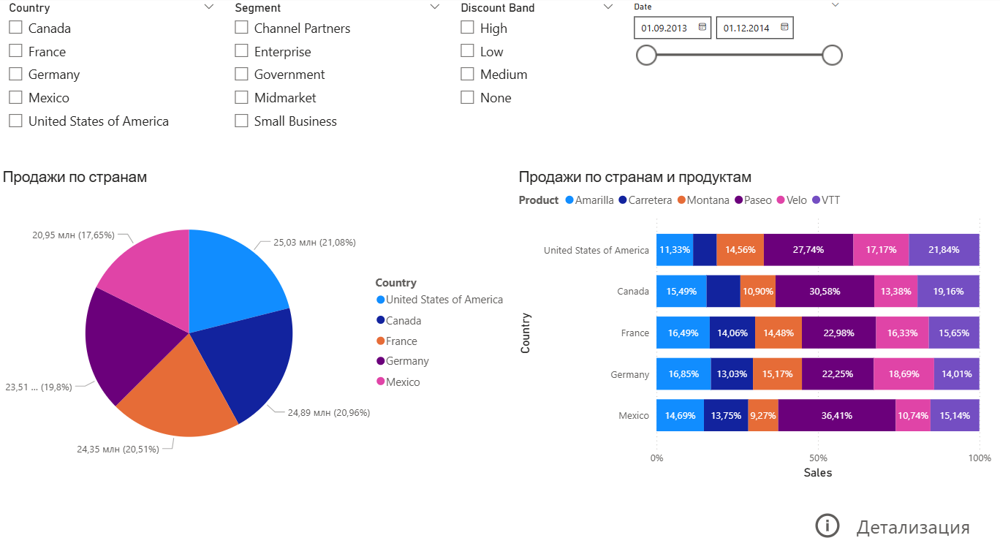
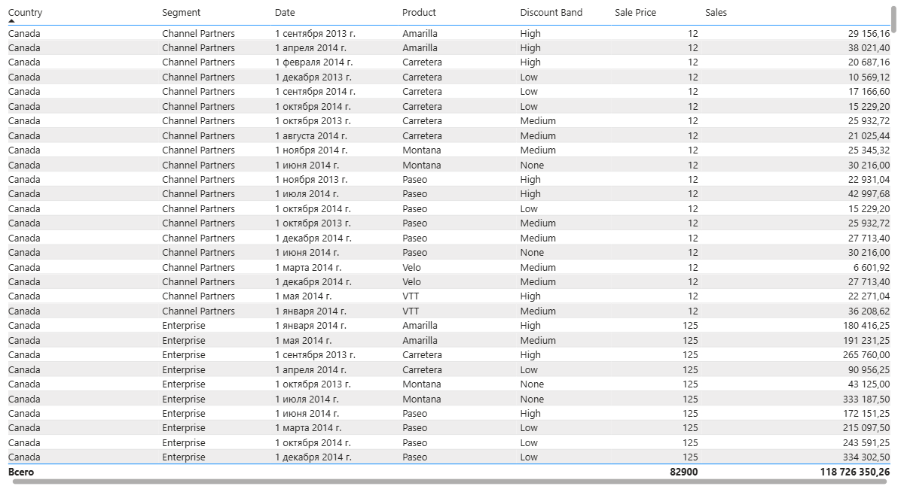

# 📊 Power BI: анализ продаж по странам, сегментам и продуктам

## 🧩 Описание проекта
Данный проект является демонстрационным.
Цель — показать навыки работы с Power BI: подготовка и трансформация данных, создание визуализаций и построение интерактивных отчётов для анализа бизнес‑показателей.

## 🎯 Цель
* Показать структуру продаж по странам, сегментам и уровням скидок;
* Сравнить доли продаж различных продуктов на разных рынках;
* Продемонстрировать применение агрегирующих вычислений DAX и визуализаций Power BI для бизнес‑аналитики.

## ⚙️ Используемые элементы отчёта
* Фильтры:
  * Country — выбор страны (Канада, США, Франция, Германия, Мексика);
  * Segment — целевой рынок (Channel Partners, Enterprise, Government, Midmarket, Small Business);
  * Discount Band — уровень скидки (High, Medium, Low, None);
  * Date range — анализ за выбранный период (период с сентября 2013 по декабрь 2014).
* Диаграммы:
  * Круговая диаграмма — структура продаж по странам;
  * 100%-я столбчатая диаграмма с накоплением — процентное распределение продаж по странам и продуктам.
* Навигация:
  * Интерактивная кнопка «Детализация» для перехода на страницу с исходными данными.

## 📈 Ключевые выводы
* Продажи распределены между странами относительно равномерно: на каждую из стран (США, Канада, Франция, Германия, Мексика) приходится от 17,65 % (Мексика) до 21,08 % (США) общей выручки;
* Продукт Paseo демонстрирует стабильную преобладающую долю на всех рынках;
* Продуктовые предпочтения зависят от страны — локальные различия в структуре спроса выражены сильно.

## 💡 Используемые технологии
* Power BI Desktop — моделирование данных и визуализация;
* Power Query — очистка и трансформация данных;
* DAX — агрегирующие вычисления (Sum) для расчёта суммарных показателей продаж.

## 🖼 Скриншоты
**Дашборд**

**Страница с исходными данными**

## 🧾 Источник данных
Отчёт создан на основе демонстрационного набора Microsoft Sample Data (Financial Sample).
Все компании, продукты и данные вымышленные и используются исключительно в учебных целях.

## 🔗 Ссылки
* 💾 [Скачать файл отчёта](https://github.com/andrewsalmin/sales-analysis/raw/refs/heads/main/sales_report.pbix)
* 🖼 [Скачать скриншоты отчёта](https://github.com/andrewsalmin/sales-analysis/raw/refs/heads/main/screenshots.zip)
